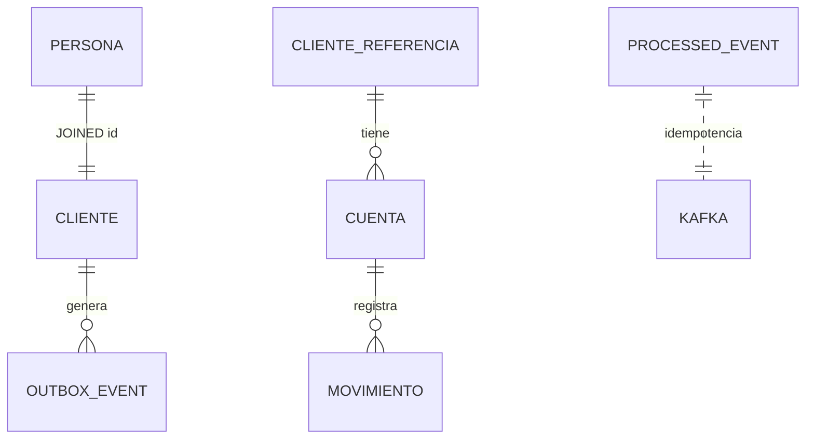

# Modelo de datos - ER y tipos SQL

Fuente de verdad para `BaseDatos.sql` y entidades JPA. Reglas de negocio y API: [instructions.md](instructions.md).

```
postgresql:5432 / devsu_db
  schema client   <- solo client-service
  schema account  <- solo account-service
```

Sin FK cross-schema. `cuenta.cliente_id` -> `cliente_referencia.id` (proyeccion Kafka).

---

## Diagrama ER



**Convenciones:** PK negocio `BIGSERIAL`; outbox/idempotencia `UUID`; montos `DECIMAL(12,2)`; snake_case; soft delete `cliente.estado=false`; sin seed SQL (ADR-16).

---

## Schema `client`

### `persona` � raiz JPA JOINED

| Columna | Tipo | Null | Restricciones |
|---|---|---|---|
| id | BIGSERIAL | NO | PK; compartido con cliente |
| nombre | VARCHAR(100) | NO | |
| genero | VARCHAR(20) | SI | Opcional API |
| edad | INTEGER | SI | CHECK 0-150 o NULL |
| identificacion | VARCHAR(20) | NO | UNIQUE |
| direccion | VARCHAR(255) | SI | |
| telefono | VARCHAR(20) | SI | |
| created_at / updated_at | TIMESTAMP | NO | DEFAULT CURRENT_TIMESTAMP |

### `cliente` � extension JOINED (misma PK)

| Columna | Tipo | Null | Restricciones |
|---|---|---|---|
| id | BIGINT | NO | PK, FK -> persona(id) |
| contrasena | VARCHAR(255) | NO | Hash BCrypt (ADR-15) |
| estado | BOOLEAN | NO | DEFAULT TRUE; FALSE = baja logica |

### `outbox_event` � Transactional Outbox

| Columna | Tipo | Null | Restricciones |
|---|---|---|---|
| id | UUID | NO | PK; = header Kafka eventId |
| aggregate_type | VARCHAR(50) | NO | Fijo: `CLIENTE` |
| aggregate_id | BIGINT | NO | id cliente |
| event_type | VARCHAR(50) | NO | ClienteCreado, ClienteActualizado, ClienteEliminado |
| payload | JSONB | NO | Ver abajo |
| correlation_id | UUID | SI | Desde MDC (ADR-12) |
| created_at | TIMESTAMP | NO | |
| published_at | TIMESTAMP | SI | NULL = pendiente |

Indice: `idx_outbox_pending` WHERE published_at IS NULL.

---

## Schema `account`

### `cliente_referencia` - proyeccion Kafka (ADR-07)

| Columna | Tipo | Null | Restricciones |
|---|---|---|---|
| id | BIGINT | NO | PK; mismo id que client-service |
| nombre | VARCHAR(100) | NO | |
| identificacion | VARCHAR(20) | NO | UNIQUE |
| activo | BOOLEAN | NO | DEFAULT TRUE |
| synced_at | TIMESTAMP | NO | |

Regla: crear cuenta exige `activo=true`.

### `cuenta`

| Columna | Tipo | Null | Restricciones |
|---|---|---|---|
| id | BIGSERIAL | NO | PK |
| cliente_id | BIGINT | NO | FK -> cliente_referencia |
| numero_cuenta | VARCHAR(20) | NO | UNIQUE |
| tipo_cuenta | VARCHAR(20) | NO | CHECK AHORROS, CORRIENTE |
| saldo | DECIMAL(12,2) | NO | DEFAULT 0; CHECK >= 0 |
| estado | VARCHAR(20) | NO | DEFAULT ACTIVA; CHECK ACTIVA, INACTIVA |
| created_at / updated_at | TIMESTAMP | NO | |

### `movimiento` � inmutable (sin UPDATE API)

| Columna | Tipo | Null | Restricciones |
|---|---|---|---|
| id | BIGSERIAL | NO | PK |
| cuenta_id | BIGINT | NO | FK -> cuenta |
| fecha | TIMESTAMP | NO | DEFAULT CURRENT_TIMESTAMP; orden cronologico |
| tipo_movimiento | VARCHAR(20) | NO | CHECK DEPOSITO, RETIRO |
| valor | DECIMAL(12,2) | NO | CHECK <> 0; signo define tipo |
| saldo_resultante | DECIMAL(12,2) | NO | CHECK >= 0 |
| created_at | TIMESTAMP | NO | |

Indice: `idx_movimiento_cuenta_fecha` (cuenta_id, fecha). Retiro con |valor| > saldo -> F3 sin INSERT.

### `processed_event` � idempotencia consumer

| Columna | Tipo | Null |
|---|---|---|
| event_id | UUID | NO PK |
| processed_at | TIMESTAMP | NO |

---

## Enums y payload Kafka

| Enum | Valores | Columna |
|---|---|---|
| TipoCuenta | AHORROS, CORRIENTE | cuenta.tipo_cuenta |
| EstadoCuenta | ACTIVA, INACTIVA | cuenta.estado |
| TipoMovimiento | DEPOSITO, RETIRO | movimiento.tipo_movimiento |

**ClienteCreado / ClienteActualizado:**
```json
{ "id": 1, "nombre": "Jose Lema", "identificacion": "1234567890", "activo": true }
```
**ClienteEliminado:** `{ "id": 1 }`

Consumer: Creado/Actualizado -> UPSERT `cliente_referencia`; Eliminado -> `activo=false`. **Nunca** contrasena en payload.

---

## Mapeo API -> columnas

| API | Columna(s) |
|---|---|
| ClienteRequest.* | persona.* + cliente.contrasena (hash) / cliente.estado |
| CuentaRequest.numeroCuenta, clienteId, saldoInicial | cuenta.numero_cuenta, cliente_id, saldo |
| MovimientoRequest.numeroCuenta, valor, fecha | join cuenta; movimiento.valor, fecha |

**JPA:** `@Inheritance(JOINED)` Persona/Cliente; `@Table(schema=...)`; `ddl-auto=validate`; BIGSERIAL IDENTITY.

---

*v1.3 � Cambios estructurales requieren nuevo ADR en instructions.md.*
