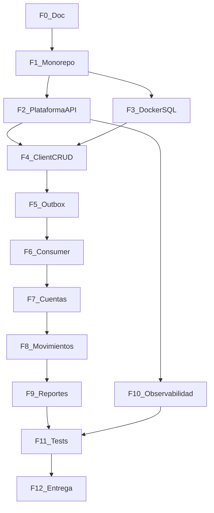

# Fases de implementacion

Hitos cortos y verificables. Spec: [instructions.md](instructions.md) | BD: [data-model.md](data-model.md) | Checklist: [evaluation.md](evaluation.md)

**Reglas:** una fase a la vez; sin modulo `shared`; sin REST entre MS; sin JWT; sin Flyway (solo `BaseDatos.sql`); sin seed SQL; envelope ApiResponse siempre; F3 message exacto `"Saldo no disponible"`. No inventar endpoints/campos - ver [instructions sec. 4](instructions.md#4-contrato-api).

---

## F0 - Documentacion (pre-codigo) [x]

- [x] Contrato API, ADR, data-model, evaluation alineados
- [x] README raiz y `.gitignore`
- **Siguiente:** F1

---

## F1 - Monorepo Maven vacio

Dos apps Spring Boot 4 compilan y arrancan (:8081 / :8082). Paquetes `com.devsu.client` / `com.devsu.account` con capas vacias.

- [x] `./mvnw clean verify` OK
- [x] `-pl client-service spring-boot:run` :8081
- [x] `-pl account-service spring-boot:run` :8082

---

## F2 - Plataforma API (ambos servicios)

`ApiResponse`, `PageResponse`, `CorrelationIdFilter`, `GlobalExceptionHandler`, logback consola + JSON.

- [x] correlationId en header, body y logs
- [x] Excepcion prueba -> envelope + HTTP correcto
- [x] MDC.clear() sin fugas

Ref: [instructions sec. 4.2-4.4](instructions.md#42-envelope-y-http-adr-11)

---

## F3 - Docker + BaseDatos.sql

`.env.example`, `docker-compose.yml`, `BaseDatos.sql`, prometheus/grafana.

- [x] `docker compose up -d` -> postgres, kafka, prometheus, grafana
- [x] Schemas `client` y `account` con tablas

---

## F4 - CRUD Cliente (sin Kafka)

JPA JOINED, CRUD `/api/clientes`, BCrypt, paginacion, DELETE logico.

- [x] CRUD con envelope + PageResponse
- [x] contrasena hasheada en BD
- [x] Caso 1 Anexo A (Postman)

Ref: [instructions sec. 5](instructions.md#5-dtos-y-recursos)

---

## F5 - Outbox + Kafka publish

Outbox en misma TX; publisher @Scheduled 3s; topic `devsu.client.events`.

- [x] Mensaje en topic tras POST/PUT/DELETE
- [x] correlationId en outbox y header Kafka

Ref: [instructions sec. 2](instructions.md#2-kafka--outbox) | [data-model](data-model.md)

---

## F6 - Consumer + cliente_referencia

KafkaListener, UPSERT `cliente_referencia`, idempotencia `processed_event`.

- [x] POST :8081 -> fila en `account.cliente_referencia`
- [x] DELETE logico -> activo=false
- [x] Reprocesar eventId no duplica

---

## F7 - CRU Cuentas

POST/GET/PUT `/api/cuentas`; validar cliente_referencia activo.

- [x] 422 sin referencia; 409 duplicado numeroCuenta
- [x] Casos 2 y 3 Anexo A

---

## F8 - Movimientos (F2 + F3 del reto)

POST/GET `/api/movimientos`; F3: 422, `SALDO_NO_DISPONIBLE`, `"Saldo no disponible"`.

- [x] Deposito/retiro actualizan saldo
- [x] Retiro excesivo no persiste
- [x] Caso 4 Anexo A

---

## F9 - Reportes (F4 del reto)

GET `/api/reportes` con fechaDesde, fechaHasta, cliente.

- [ ] Caso 5 Marianela Montalvo feb-2022
- [ ] Cliente inexistente -> 404

---

## F10 - Observabilidad Docker full

Dockerfiles, apps en compose, `/actuator/prometheus`.

- [ ] Stack completo `docker compose up`
- [ ] Grafana :3000

---

## F11 - Pruebas

Min. 1 test unitario Cliente; bonus Testcontainers.

- [ ] `./mvnw test` verde

---

## F12 - Entrega final

Postman, OpenAPI, evaluation, repo publico + ZIP/RAR.

- [ ] Flujo Casos 1-5 reproducible
- [ ] Sin secretos en repo
- [ ] README con instrucciones finales de ejecucion

---

## Estado de avance

| Fase | Estado |
|---|---|
| F0 | [x] Completo |
| F1 | [x] Completo |
| F2 | [x] Completo |
| F3 | [x] Completo |
| F4 | [x] Completo |
| F5 | [x] Completo |
| F6 | [x] Completo |
| F7 | [x] Completo |
| F8 | [x] Completo |
| F9-F12 | [ ] Pendiente |

*Actualizar al completar cada fase.*
