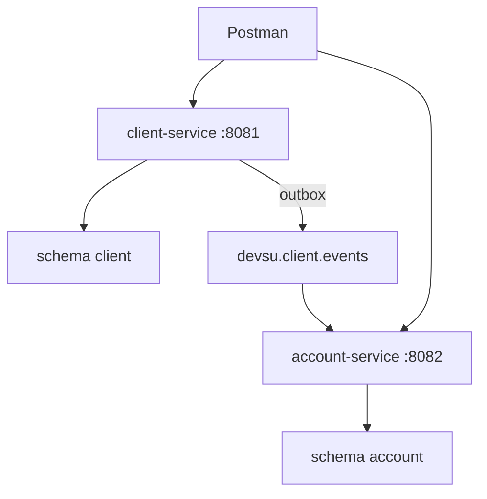

---
document: Arquitectura y Decisiones del Proyecto
project: Devsu Microservicios Bancarios
author: JMVELEZ
version: 3.9
status: Living document
related:
  - evaluation.md
  - implementation-phases.md
  - data-model.md
---

# Documento de Arquitectura y Decisiones

> Como decidi construir la solucion del reto Devsu. Checklist: [evaluation.md](evaluation.md) | Indice: [README.md](README.md)

| Documento | Uso |
|---|---|
| **Este archivo** | ADR, arquitectura, API, reglas de negocio |
| [data-model.md](data-model.md) | ER, columnas, tipos SQL |
| [implementation-phases.md](implementation-phases.md) | Fases F0-F12 |
| [evaluation.md](evaluation.md) | Checklist pre-entrega |

Reto Devsu: **2 microservicios** bancarios, API REST, JPA, Docker, comunicacion **asincrona**. Este doc concentra **decisiones de diseno**, no el enunciado completo. Kafka/Outbox: seccion 2 de este archivo.

---

## Registro de decisiones (ADR)

| ID | Decision | Alternativas | Motivo |
|---|---|---|---|
| ADR-01 | Java 25 + Spring Boot 4 | Java 21 + Boot 3 | Stack moderno, LTS |
| ADR-02 | Gradle monorepo | Maven multi-modulo | Build unificado |
| ADR-03 | Clean Architecture por servicio | MVC clasico | Dominio aislado, testeable |
| ADR-04 | Puertos Repository | JpaRepository en use cases | JPA solo en infra |
| ADR-05 | Kafka + Transactional Outbox | REST sync, RabbitMQ | Async real + consistencia |
| ADR-06 | 1 PostgreSQL, 2 schemas | 2 instancias PG | KISS en Docker |
| ADR-07 | Tabla `cliente_referencia` | REST a client-service | Reportes F4 locales |
| ADR-08 | OpenAPI (springdoc) | Solo Postman | Contrato vivo |
| ADR-09 | Sin auth/JWT | JWT en client-service | YAGNI; no lo exige el reto |
| ADR-10 | Documentacion minima | Muchos .md | README + este doc + OpenAPI |
| ADR-11 | Envelope JSON + HTTP semanticos | 200 con success:false | F3 con mensaje exacto |
| ADR-12 | correlationId + logs dual | Interceptor MVC | Filter + MDC; consola + JSON |
| ADR-13 | Configuracion por .env | Hardcode | Secretos fuera del repo |
| ADR-14 | Paginacion en listados | Lista completa | page=0, size=20, max 100 |
| ADR-15 | Contrasena: hash BCrypt | Texto plano | Hash al persistir; sin login |
| ADR-16 | BaseDatos.sql solo DDL | INSERT seed | Anexo A via API/Postman |

---

## 1. Vision y stack

| Servicio | Puerto | Responsabilidad |
|---|---|---|
| **client-service** | 8081 | Persona, Cliente (CRUD) |
| **account-service** | 8082 | Cuenta, Movimiento, Reportes |

Integracion entre servicios: **solo Kafka** (nunca REST sincrono). Stack: Java 25, Spring Boot 4, Gradle, PostgreSQL/JPA, Kafka+Outbox, Micrometer/Prometheus/Grafana, springdoc, JUnit 5/Mockito/Postman, Docker Compose.



Capas por servicio (`domain` → `application` → `infrastructure` → `api`). Repository pattern: puerto en application, JpaRepository en infrastructure.

Estructura repo planificada: monorepo con `client-service/`, `account-service/`, `docker-compose.yml`, `BaseDatos.sql`, `postman/`, `documentation/`. Entrada al proyecto: [README.md](../README.md). Estado: F0 completada (spec + README + .gitignore).

---

## 2. Kafka + Outbox

- account-service **no llama** REST a client-service al crear cuenta.
- Misma TX: INSERT cliente + INSERT `outbox_event`. Publisher `@Scheduled(3s)` publica pendientes (`published_at IS NULL`).
- **Topic:** `devsu.client.events` | **Headers:** `correlationId`, `eventType`, `eventId`
- **Idempotencia:** tabla `processed_event` en account-service.

| Evento | Disparador | Payload |
|---|---|---|
| ClienteCreado | POST /clientes | id, nombre, identificacion, activo |
| ClienteActualizado | PUT /clientes | id, nombre, identificacion, activo |
| ClienteEliminado | DELETE /clientes | id |

Payload detallado: [data-model.md](data-model.md). `activo` en payload = `cliente.estado`.

Kafka **no** interviene en movimientos ni reportes (solo datos locales en account-service).

---

## 3. Modelo de datos

PostgreSQL `devsu_db`: schemas `client` (persona, cliente, outbox_event) y `account` (cliente_referencia, cuenta, movimiento, processed_event). Sin FK cross-schema.

**Reglas clave:**

| Regla | Comportamiento |
|---|---|
| Deposito / Retiro | valor > 0 / valor < 0; actualiza saldo |
| Saldo insuficiente (F3) | HTTP 422, message exacto `"Saldo no disponible"`; saldo no cambia |
| Crear cuenta | `cliente_id` en `cliente_referencia` con `activo=true` |
| Persona/Cliente | JPA JOINED en schema `client` |
| Contrasena (ADR-15) | BCrypt en POST/PUT; nunca en GET, logs ni Kafka |

Columnas, tipos, indices, enums: **[data-model.md](data-model.md)**. DDL en `BaseDatos.sql` (fase F3, sin seed).

---

## 4. Contrato API

### 4.1 Endpoints

| Metodo | Servicio | Path |
|---|---|---|
| CRUD | client-service :8081 | `/api/clientes` |
| CRU | account-service :8082 | `/api/cuentas`, `/api/movimientos` |
| GET | account-service :8082 | `/api/reportes?fechaDesde=&fechaHasta=&cliente=` |

Sin PATCH. Movimientos: solo POST y GET. Swagger: `/swagger-ui.html`.

### 4.2 Envelope y HTTP (ADR-11)

Todas las respuestas usan `ApiResponse<T>`: `success`, `data`, `error` { `code`, `message` }, `correlationId`. Header opcional `X-Correlation-Id` (UUID; si falta, se genera).

```json
{ "success": true, "data": { }, "error": null, "correlationId": "..." }
```

```json
{ "success": false, "data": null, "error": { "code": "SALDO_NO_DISPONIBLE", "message": "Saldo no disponible" }, "correlationId": "..." }
```

| Situacion | HTTP | error.code |
|---|---|---|
| Exito GET/PUT | 200 | — |
| POST creado | 201 | — |
| Validacion | 400 | VALIDATION_ERROR |
| No encontrado | 404 | CLIENTE_NOT_FOUND, CUENTA_NOT_FOUND |
| Regla de negocio | 422 | SALDO_NO_DISPONIBLE, CLIENTE_INACTIVO |
| Duplicado | 409 | CLIENTE_DUPLICADO, CUENTA_DUPLICADA |
| Error interno | 500 | INTERNAL_ERROR |

**F3 (obligatorio):** HTTP **422**, code `SALDO_NO_DISPONIBLE`, message **`Saldo no disponible`** (exacto, con tilde).

Dominio lanza excepciones; `GlobalExceptionHandler` en `api` mapea a envelope + HTTP. Sin stack trace al cliente.

### 4.3 Paginacion (ADR-14)

GET list de `/clientes`, `/cuentas`, `/movimientos`: query `page` (default **0**), `size` (default **20**, max **100**). `data` = `PageResponse`: `content`, `page`, `size`, `totalElements`, `totalPages`, `first`, `last`. Orden default: `id` ASC.

### 4.4 Trazabilidad (ADR-12)

`CorrelationIdFilter` (OncePerRequestFilter) → MDC `correlationId` → body + header response. Logback: consola legible + archivo `logs/{service}.json` (logstash-logback-encoder). Propagar a `outbox_event.correlation_id` y headers Kafka. Consumer restaura MDC. No loguear PII en INFO.

Componentes por servicio (sin modulo shared): `CorrelationIdFilter`, `CorrelationContext`, `GlobalExceptionHandler`, `ApiResponse`, `PageResponse`.

---

## 5. DTOs y recursos

Convenciones: IDs `number` (Long); `numeroCuenta` string; fechas `yyyy-MM-dd`; enums `AHORROS|CORRIENTE|ACTIVA|INACTIVA|DEPOSITO|RETIRO`. DELETE cliente = baja logica (`estado=false`, HTTP 200). Mapeo API→BD: [data-model.md](data-model.md).

### Clientes (`/api/clientes`)

**ClienteRequest** (POST/PUT): nombre*, identificacion*, direccion*, telefono*, contrasena*, estado* (boolean), genero, edad. PUT: contrasena vacia/null mantiene hash.

**ClienteResponse:** id, nombre, identificacion, direccion, telefono, genero, edad, estado (sin contrasena).

| Metodo | HTTP | Notas |
|---|---|---|
| POST | 201 | UK identificacion → 409 CLIENTE_DUPLICADO |
| GET / GET/{id} | 200 / 404 | List paginado; incluye inactivos |
| PUT /{id} | 200 / 404 | Publica ClienteActualizado (F5) |
| DELETE /{id} | 200 | estado=false; ClienteEliminado (F5) |

Ejemplo POST (Anexo A):
```json
{ "nombre": "Jose Lema", "identificacion": "1000000001", "direccion": "Otavalo sn y principal", "telefono": "098254785", "contrasena": "1234", "estado": true }
```

### Cuentas (`/api/cuentas`)

**CuentaRequest:** clienteId*, numeroCuenta*, tipoCuenta*, saldoInicial*, estado (default ACTIVA).

**CuentaUpdateRequest** (PUT): solo tipoCuenta, estado. No cambiar numeroCuenta, clienteId ni saldo.

**CuentaResponse:** id, clienteId, numeroCuenta, tipoCuenta, saldo, estado.

Errores POST: 422 CLIENTE_NOT_FOUND / CLIENTE_INACTIVO; 409 CUENTA_DUPLICADA.

### Movimientos (`/api/movimientos`)

**MovimientoRequest:** numeroCuenta*, valor* (positivo=deposito, negativo=retiro, !=0), fecha (default hoy).

**MovimientoResponse:** id, cuentaId, numeroCuenta, fecha, tipoMovimiento, valor, saldoResultante.

Ejemplo retiro Caso 4: `{ "numeroCuenta": "478758", "valor": -575, "fecha": "2022-02-01" }`

### Reportes (`/api/reportes`)

Query: fechaDesde*, fechaHasta* (inclusive), cliente* (nombre exacto, case-insensitive).

**ReporteResponse:** cliente, fechaDesde, fechaHasta, cuentas[] { numeroCuenta, saldoActual, movimientos[] { fecha, valor, saldoResultante } }.

Todas las cuentas del cliente; movimientos filtrados por rango. Cliente inexistente → 404 CLIENTE_NOT_FOUND.

Ejemplo Caso 5: `GET /api/reportes?fechaDesde=2022-02-01&fechaHasta=2022-02-28&cliente=Marianela Montalvo`

### Catalogo de excepciones

| Situacion | error.code | HTTP |
|---|---|---|
| Bean Validation / valor=0 / page-size invalido | VALIDATION_ERROR | 400 |
| Cliente / cuenta / movimiento no encontrado | CLIENTE_NOT_FOUND / CUENTA_NOT_FOUND / MOVIMIENTO_NOT_FOUND | 404 |
| Identificacion o numeroCuenta duplicado | CLIENTE_DUPLICADO / CUENTA_DUPLICADA | 409 |
| Cliente inactivo o sin referencia al crear cuenta | CLIENTE_INACTIVO / CLIENTE_NOT_FOUND | 422 |
| Saldo insuficiente (F3) | SALDO_NO_DISPONIBLE | 422 |
| Error no controlado | INTERNAL_ERROR | 500 |

---

## 6. Calidad, infra y pruebas

- **Pruebas:** JUnit 5 + Mockito (min. 1 test Cliente); Testcontainers bonus; Postman Anexo A.
- **Observabilidad:** Micrometer → `/actuator/prometheus`; Grafana; ADR-12 logs.
- **Java 25:** Records en DTOs; sealed classes opcional en excepciones; entidades JPA como clases.
- **Docker (ADR-13):** `.env.example` → `.env` → `docker compose up`. Variables: POSTGRES_*, KAFKA_PORT, GRAFANA_*, PROMETHEUS_PORT, CLIENT/ACCOUNT_SERVICE_PORT, KAFKA_TOPIC_CLIENT_EVENTS.
- **Contenedores:** client-service, account-service, postgres, kafka, prometheus, grafana.

### Flujo de prueba (Casos 1-5)

1. Docker Compose up
2. POST clientes :8081 (Caso 1) → esperar sync Kafka → `cliente_referencia`
3. POST cuentas :8082 (Casos 2-3)
4. POST movimientos :8082 (Caso 4; fechas 2022 para Caso 5)
5. GET reportes :8082 (Caso 5)

---

## Anexo A — Datos de prueba (reto Devsu)

**Mapeo a la API:** tipo cuenta del Anexo → `AHORROS` / `CORRIENTE` en JSON. Movimientos: deposito = `valor` positivo; retiro = `valor` negativo (ej. retiro 575 en cuenta 478758 → `"valor": -575`).

### A.1 Clientes

| Nombres | Direccion | Telefono | Contrasena | Estado |
|---|---|---|---|---|
| Jose Lema | Otavalo sn y principal | 098254785 | 1234 | True |
| Marianela Montalvo | Amazonas y NNUU | 097548965 | 5678 | True |
| Juan Osorio | 13 junio y Equinoccial | 098874587 | 1245 | True |

### A.2 Cuentas iniciales

| Numero | Tipo | Saldo | Cliente |
|---|---|---|---|
| 478758 | Ahorros | 2000 | Jose Lema |
| 225487 | Corriente | 100 | Marianela Montalvo |
| 495878 | Ahorros | 0 | Juan Osorio |
| 496825 | Ahorros | 540 | Marianela Montalvo |

### A.3 Cuenta adicional

| Numero | Tipo | Saldo | Cliente |
|---|---|---|---|
| 585545 | Corriente | 1000 | Jose Lema |

### A.4 Movimientos

| Cuenta | Movimiento |
|---|---|
| 478758 | Retiro 575 |
| 225487 | Deposito 600 |
| 495878 | Deposito 150 |
| 496825 | Retiro 540 |

### A.5 Resultado esperado reporte

| Fecha | Cliente | Cuenta | Movimiento | Saldo final |
|---|---|---|---|---|
| 10/2/2022 | Marianela Montalvo | 225487 | 600 | 700 |
| 8/2/2022 | Marianela Montalvo | 496825 | -540 | 0 |

Ejemplo respuesta Caso 5 (fragmento `data`):

```json
{
  "cliente": "Marianela Montalvo",
  "fechaDesde": "2022-02-01",
  "fechaHasta": "2022-02-28",
  "cuentas": [
    {
      "numeroCuenta": "225487",
      "saldoActual": 700,
      "movimientos": [
        { "fecha": "2022-02-10", "valor": 600, "saldoResultante": 700 }
      ]
    },
    {
      "numeroCuenta": "496825",
      "saldoActual": 0,
      "movimientos": [
        { "fecha": "2022-02-08", "valor": -540, "saldoResultante": 0 }
      ]
    }
  ]
}
```

Cuentas del cliente sin movimientos en el rango aparecen con `movimientos: []`.

---

*Documento vivo v3.9. Roadmap: [implementation-phases.md](implementation-phases.md)*
